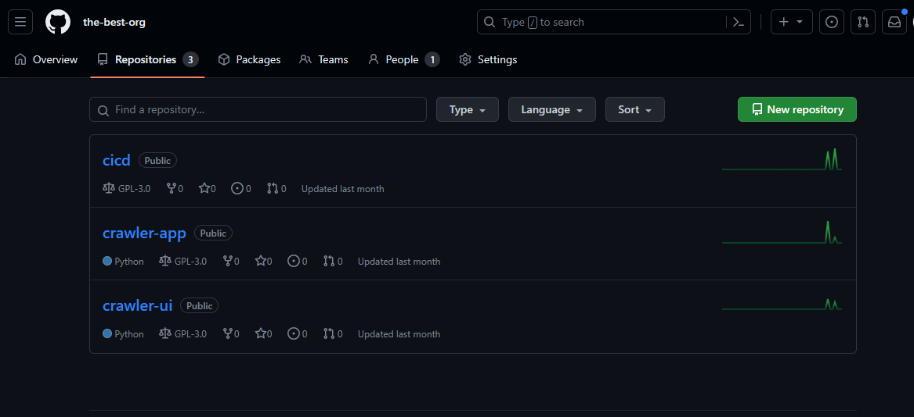
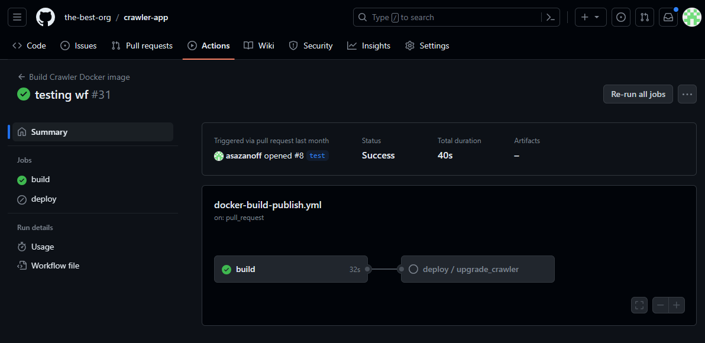
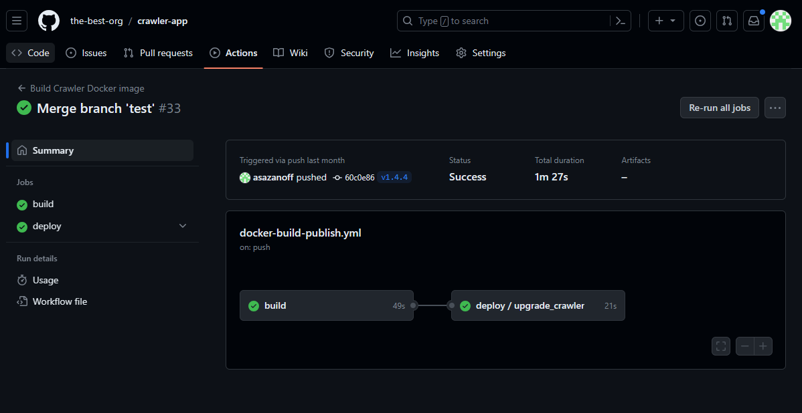
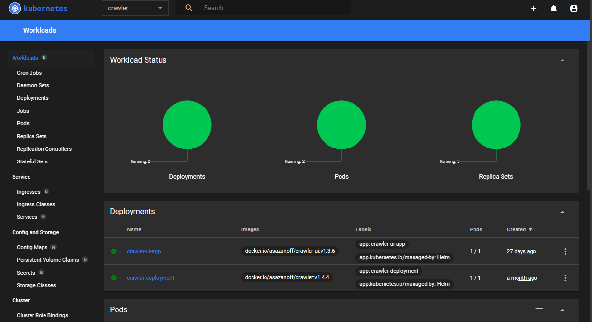
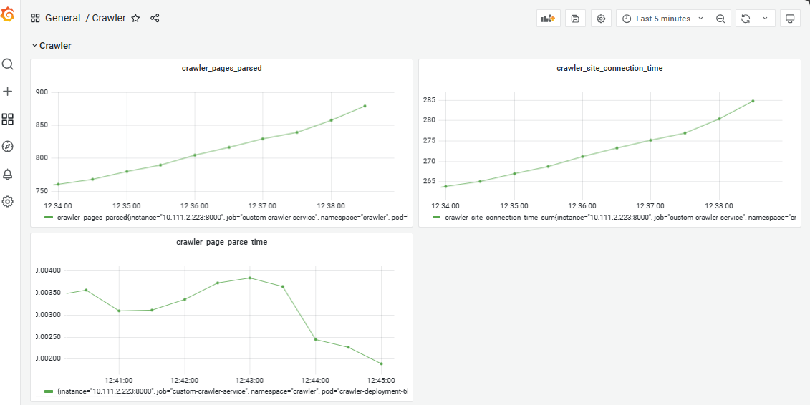
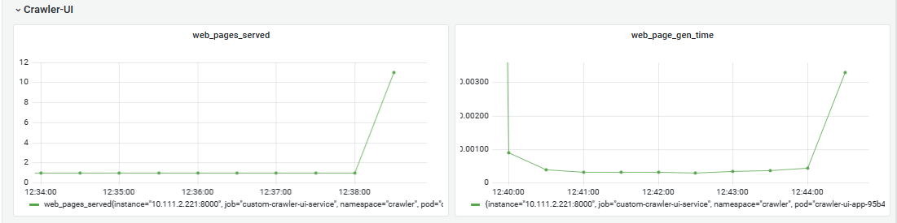
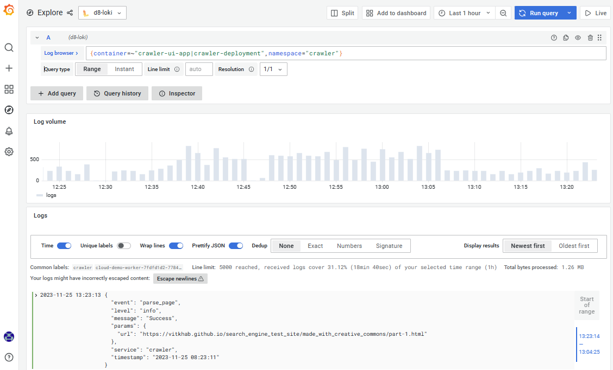

# CD-репозиторий для Crawler-app и Crawler-UI

В репозитории находятся Helm-чарты и пайплайны для доставки приложений в кластер Kubernetes.

Код приложений и пайплайны сборки находятся в их собственных репозиториях.



# Используемые инструменты

1. Deckhouse в качестве кластера Kubernetes
2. Mongo и Rabbit развернуты через Helm-чарты Bitnami
3. Сбор и визуализация метрик Prometheus + Grafana, сбор логов Loki
4. Git и Ci-Cd система Github

## MongoDB и RabbitMQ

Для развертывания Mongo и Rabbit используйте чарты Bitnami с кастомными values из директории `services-values`:
```bash
helm repo add bitnami https://charts.bitnami.com/bitnami
helm upgrade --install mongodb bitnami/mongodb --version 14.0.4 -f services-values\mongodb.yaml
helm upgrade --install rabbitmq bitnami/rabbitmq --version 10.3.9 -f services-values\rabbitmq.yaml
```

## Crawler-app

Чарт находится в директории `crawler`, разворачивает Deployment и Service. В values можно определить несекретные параметры (соединение с БД и брокером сообщений, URL и базовый-образ приложения). Секретные параметры, в том числе kubeconfig-файл и креды для доступа к брокеру или БД (если необходимо) можно сохранить в секретах Github Actions. Подстановка этих переменных происходит на уровне выполнения пайплайна через `--set var=value`.

Пайплайн вызывается из репозитория с приложением, в котором происходит его релизная сборка, и выкладывается в Kubernetes-кластер через Helm. 

## Crawler-UI

Чарт находится в директории `crawler-ui`, разворачивает Deployment, Service и Ingress. В Values можно определить параметры доступа к БД, путь к исполняемому файлу приложения и домен, который будет использовать Ingress-контроллер. 

Пайплайн вызывается из репозитория с приложением, в котором происходит его релизная сборка, и выкладывается в Kubernetes-кластер через Helm. 

# Работа с репозиториями с кодом

Изменения производятся в собственных ветках. Пайплайн внутренних тестов происходит в момент Pull-request к ветке Main. 



Релиз и работа CD-пайплайнов происходит при создании релиза в Github. Версии приложений должны быть в формате `v*.*.*`, где `*` -- число. При создании релиза образ выкладывается в Dockerhub, а Helm-чарт с тегом версии разворачивается в кластере.



Здесь также возможно сделать разворачивание приложения в отдельном неймспейсе для тестовых целей, при изменении main-ветки.

Для создания kubeconfig с кредами сервисного аккаунта можете использовать эти команды
```bash
kubectl config set-cluster my-cluster --server=https://$(kubectl -n d8-user-authn get ing kubernetes-api -ojson | jq '.spec.rules[].host' -r)  --kubeconfig=kube.config
kubectl config set-credentials github-actions-deploy.my-cluster --token=$(kubectl -n d8-service-accounts get secret github-actions-deploy-token -o json |jq -r '.data["token"]' | base64 -d) --kubeconfig=kube.config
kubectl config set-context my-cluster-github-actions-deploy.my-cluster --cluster=my-cluster --user=github-actions-deploy.my-cluster --kubeconfig=kube.config
kubectl config use-context my-cluster-github-actions-deploy.my-cluster --kubeconfig=kube.config
```


# Мониторинг

Отправка метрик приложения в Prometheus происходит через аннотацию `prometheus.deckhouse.io` в сервисах. Метрики появятся в Prometheus Декхауса автоматически.

Дашборд для мониторинга приложения в Grafana находится в файле `crawler-dashboard.json`.





Отправка логов в Loki настраивается применением конфигурации:

```yaml
apiVersion: deckhouse.io/v1alpha1
kind: ModuleConfig
metadata:
  name: loki
spec:
  version: 1
  enabled: true
---
apiVersion: deckhouse.io/v1alpha1
kind: ClusterLoggingConfig
metadata:
  name: all-logs
spec:
  type: KubernetesPods
  destinationRefs:
  - loki-storage
---
apiVersion: deckhouse.io/v1alpha1
kind: ClusterLogDestination
metadata:
  name: loki-storage
spec:
  type: Loki
  loki:
    endpoint: http://loki.d8-monitoring:3100
```

Loki имеет внутренний инструмент парсинга json, дополнительная настройка не нужна.



Сбор метрик компонентов Deckhouse и их визуализация не требует настройки.

Трейсинг не реализован, поскольку в приложении нет документации по инструментам для ее трассировки.

# Выполненные работы
## Сентябрь 2023
1. В Yandex Cloud развернут кластер Kubernetes
2. Созданы докерфайлы для приложений
3. Запуск и проверка работоспособности приложений

## Октябрь 2023 
1. Донастройка логирования и отправки метрик
2. Создание конвейера для сборки приложения
3. Создание и настройка конвейера для развертывания приложения
4. Создание дашборда для визуализации метрик приложения
